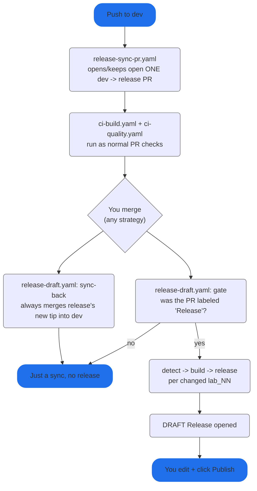

# Releasing

Two long-lived branches: `dev` (all work happens here) and `release` (source of
GitHub Releases). One `Release` label decides whether a merge also cuts a
release. No version scheme, identity is the `lab-NN` tag alone.

## Flow

## What triggers what

| Event                                   | Workflow                                      | Result                                                                                                                              |
|-----------------------------------------|-----------------------------------------------|-------------------------------------------------------------------------------------------------------------------------------------|
| Push to `dev`                           | `release-sync-pr.yaml`                        | Opens the `dev -> release` PR if `dev` is ahead and none is open yet. No path filter - any change on `dev` counts                   |
| PR into `release` merged (any strategy) | `release-draft.yaml` / `sync-back`            | Always merges `release`'s new tip back into `dev`, so the branches never desync at the commit-graph level even after a squash merge |
| ...same, PR had no `Release` label      | `release-draft.yaml` / `gate`                 | Stops after `sync-back`. Nothing built, no release                                                                                  |
| ...same, PR had the `Release` label     | `release-draft.yaml` / `detect,build,release` | Diffs the merge for changed `lab_NN/`, builds it on 3 OSes, opens a draft Release per changed lab                                   |
| Manual run, `labs` input given          | `release-draft.yaml`                          | Skips the label check and the diff, builds/releases exactly the labs you typed                                                      |

> [!IMPORTANT]
> The `Release` label must exist in the repo already (Issues/PRs -> Labels ->
> New label, one-time setup) before you can add it to a PR.

> [!IMPORTANT]
> A merge touching more than one `lab_NN/` at once produces one draft per
> changed lab, not one combined draft.

## Where each value comes from

| Value in the draft release | Source                                                                                                                                                       |
|----------------------------|--------------------------------------------------------------------------------------------------------------------------------------------------------------|
| Title                      | `lab_NN/README.md`'s first `# ` heading, used verbatim (e.g. `# Lab 01 - Linear algorithms` -> title `Lab 01 - Linear algorithms`)                           |
| Tag                        | `lab-NN`, from the `lab_NN/` directory name - not parsed from the README                                                                                     |
| `labNN-<os>-x86_64[.exe]`  | Built from `lab_NN/build/release/labNN[.exe]` via `cmake --preset release` inside `lab_NN/`, natively on `ubuntu-latest`, `windows-latest`, `macos-latest`   |
| PDF assets                 | Every `*.pdf` in `lab_NN/docs/` (report, task, anything else), copied as-is under their original filenames. Skipped (with a `::warning::`) if there are none |

## Tokens / permissions

Everything runs on the default `GITHUB_TOKEN`:

| Job         | Needs                      | Why                                               |
|-------------|----------------------------|---------------------------------------------------|
| `sync-pr`   | `pull-requests: write`     | Opens the promotion PR                            |
| `sync-back` | `contents: write`          | Pushes the merge commit directly to `dev`         |
| `gate`      | default (`contents: read`) | `gh api .../pulls` to read the merged PR's labels |
| `build`     | default (`contents: read`) | Just checks out and compiles                      |
| `release`   | `contents: write`          | Creates the draft release + uploads assets        |

> [!WARNING]
> `sync-back` pushes straight to `dev`, bypassing PRs. If `dev` has a branch
> protection rule that blocks direct pushes even from Actions, that push will
> fail, and you'll need to merge `release` into `dev` by hand - either allow
> `github-actions[bot]` past the rule, or exempt this one workflow.

Pushes made with `GITHUB_TOKEN` (the `sync-back` merge, the draft release
commit-ish) don't themselves trigger other `push`-triggered workflows - by
GitHub's design, to avoid recursive runs. That's fine here: nothing downstream
needs to react to the sync-back push itself.
