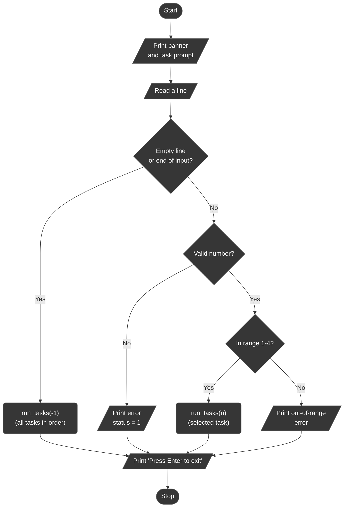
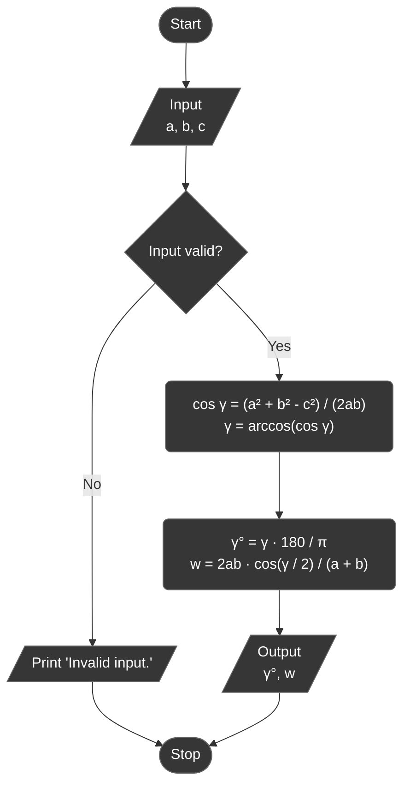
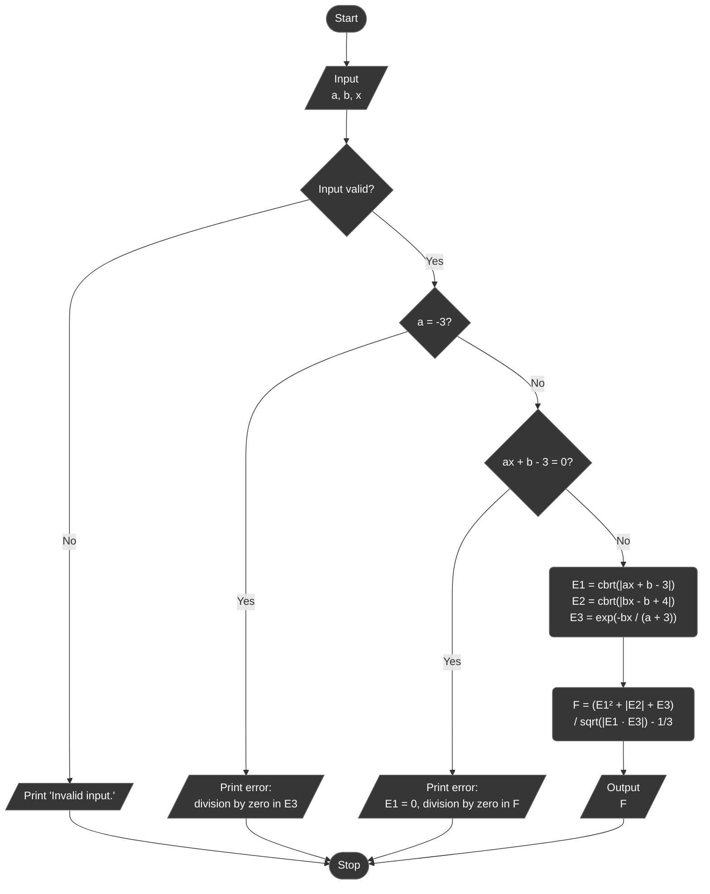
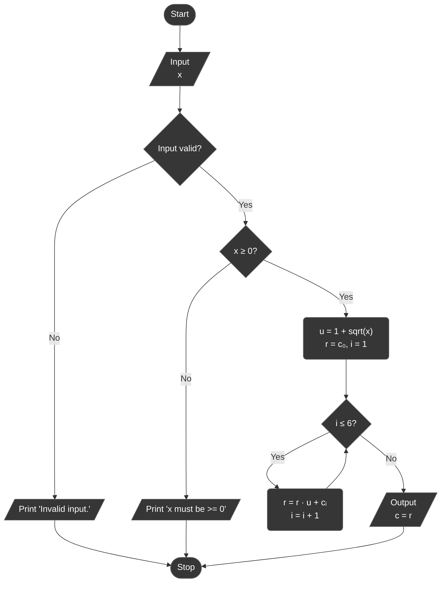
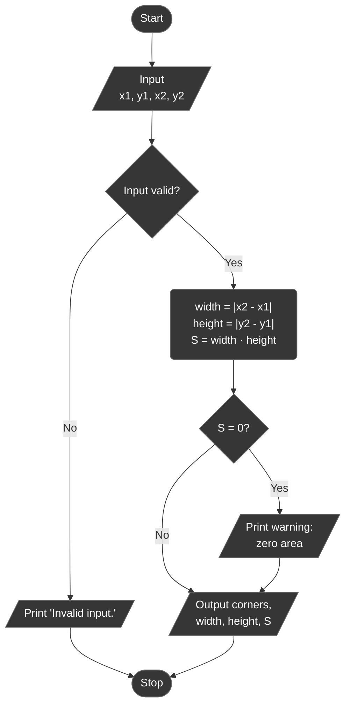

# Lab 01 - Linear algorithms

Assignment: [docs/task.pdf](docs/task.pdf)

Variant 9. The goal of the lab is to get familiar with the structure of a C
program, console I/O, simple data types and expressions, and to describe each
algorithm with a block diagram before writing the code.

## Overview

A console program that solves the four tasks of the variant. Run it and enter
a task number (`1`-`4`), or just press Enter to run all of them in order. Every
task reads its input from the keyboard, echoes the input back with a label and
prints the result with 4 decimal places.

| Task | What it does                                                                                          |
|------|-------------------------------------------------------------------------------------------------------|
| 1    | Triangle with sides `a`, `b`, `c`: angle `γ` (between `a` and `b`) and the bisector `w` drawn from it |
| 2    | Function `F(E1, E2, E3)` with the variant's `E1`, `E2`, `E3`                                          |
| 3    | Polynomial in `u = 1 + √x`, evaluated with Horner's method                                            |
| 4    | Area of the shaded figure (Fig. 1.11, item 9), computed from two opposite corners                     |

### Project layout

```
lab_01/
├── include/
│   ├── tasks.h   # task registry (X-macro) and run_tasks()
│   └── utils.h   # read_double() / read_doubles(), PI
└── src/
    ├── main.c    # menu, task number parsing
    ├── runner.c  # dispatches to run_task1() ... run_task4()
    ├── taskN.c   # each task 'N' in its own source file
    ├── ...
    └── utils.c   # implementation of utility functions
```

## Program flow



## Task 1 - Triangle: angle γ and bisector w

Given the sides `a`, `b`, `c` of a triangle, find the angle `γ` opposite side
`c` and the bisector `w` drawn from its vertex:

```
cos γ = (a² + b² - c²) / (2ab)
γ     = arccos(cos γ)
w     = 2ab · cos(γ / 2) / (a + b)
```



## Task 2 - Function F(E1, E2, E3)

```
E1 = ∛|ax + b - 3|
E2 = ∛|bx - b + 4|
E3 = e^(-bx / (a + 3))

F  = (E1² + |E2| + E3) / √|E1 · E3| - 1/3
```



## Task 3 - Horner's method

```
c = -3.7·u⁶ + 4.1·u³ - 2.1·u + 1.2,    u = 1 + √x
```

Written out as a full degree-6 polynomial the coefficients are
`{-3.7, 0, 0, 4.1, 0, -2.1, 1.2}` (the missing `u⁵`, `u⁴` and `u²` terms are
zeros, which Horner's scheme requires), so the value is computed as
`((((((-3.7·u + 0)·u + 0)·u + 4.1)·u + 0)·u - 2.1)·u + 1.2)` with one
multiplication and one addition per coefficient.



## Task 4 - Area of the shaded figure

Figure 9 of Fig. 1.11 is a rectangle spanning `x ∈ [-2, 2]` and `y ∈ [0, 2]`.
The program is not tied to that one shape: it takes two opposite corners of
any axis-aligned rectangle and computes

```
width  = |x2 - x1|
height = |y2 - y1|
S      = width · height
```

so the figure of the variant is entered as the corners `(-2, 0)` and `(2, 2)`.



## Results

Run with the variant's data from the assignment tables (Task 2 has no table
values, so `a = b = x = 1` was used). Every value was cross-checked against an
independent Python calculation of the same formulas.

| Task | Input                                 | Output                             |
|------|---------------------------------------|------------------------------------|
| 1    | `a = 38.93`, `b = 42.21`, `c = 34.42` | `γ = 50.0002°`, `w = 36.7088`      |
| 2    | `a = 1`, `b = 1`, `x = 1`             | `F = 3.4811`                       |
| 3    | `x = 30.5`                            | `c = -283817.9510`                 |
| 4    | `(-2, 0)`, `(2, 2)`                   | `width = 4`, `height = 2`, `S = 8` |

## Build & run

Standalone (from this directory):

```bash
make build
make run
```

From the repository root:

```bash
make build LAB=01
make run LAB=01
```
