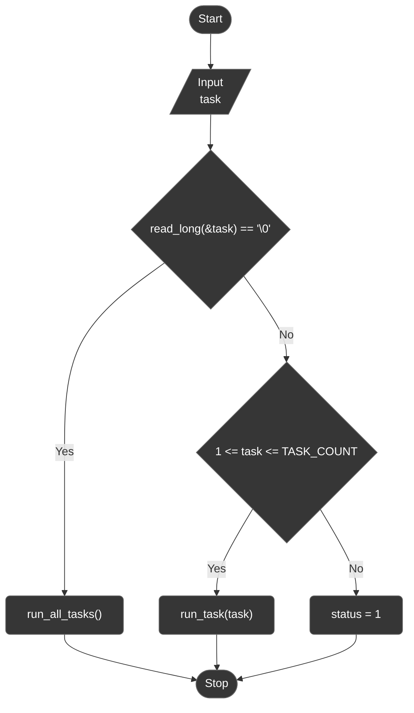
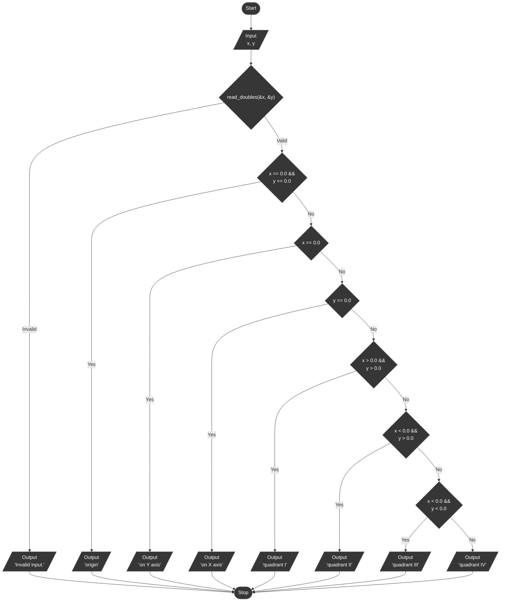
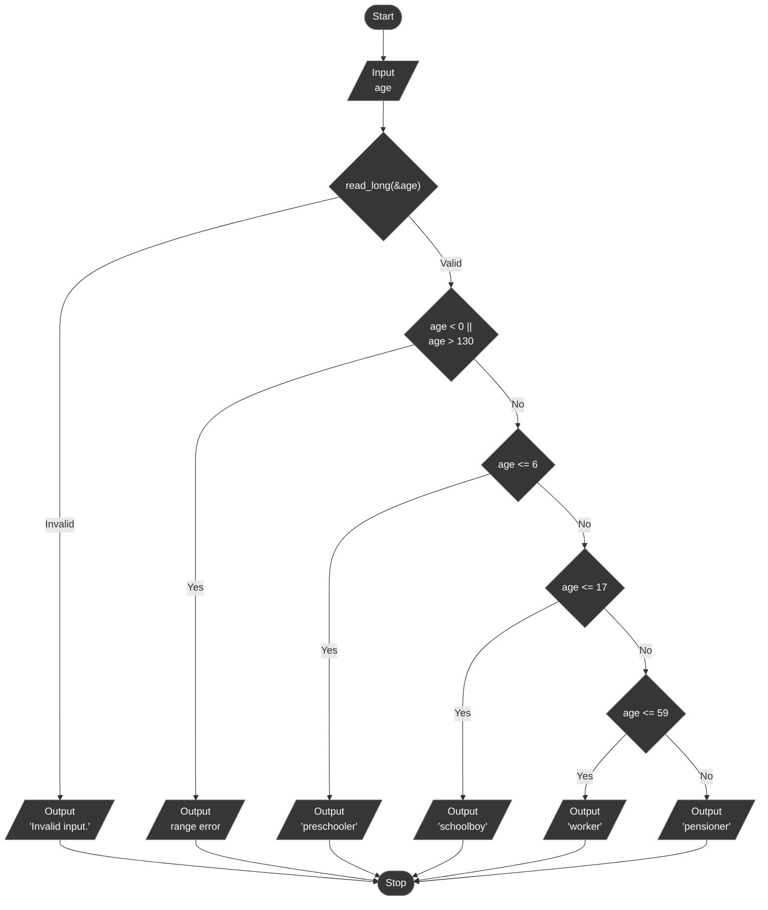
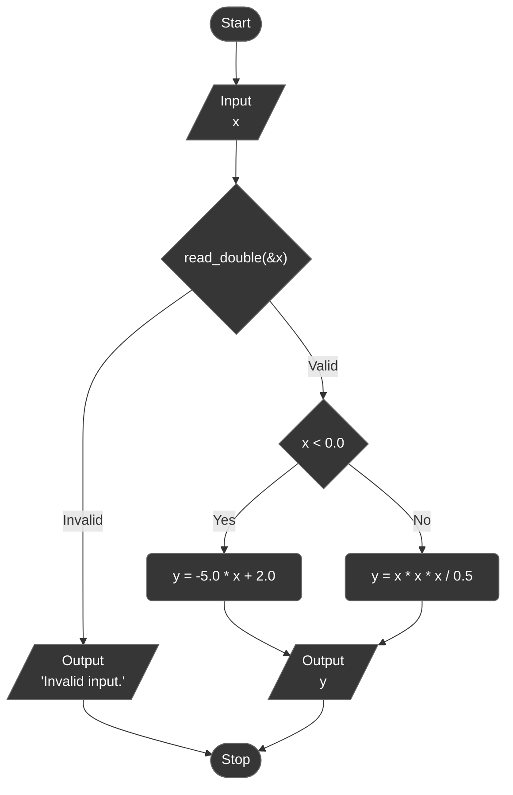
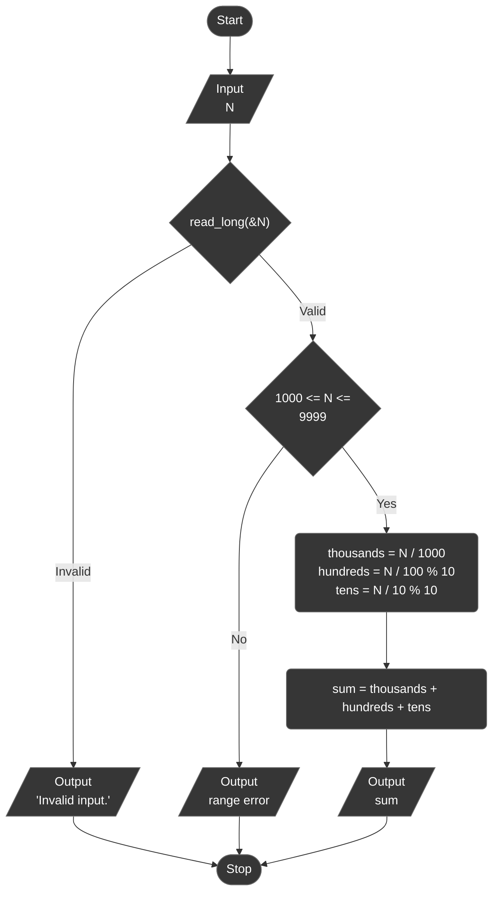

# Lab 02 - Branched algorithms

Assignment: [docs/task.pdf](docs/task.pdf)

Variant 9. The goal of the lab is to get familiar with the `if` / `else`
conditional operator, including nested conditionals, and to describe each
algorithm with a block diagram before writing the code.

## Overview

| Task | What it does                                                                |
|------|-----------------------------------------------------------------------------|
| 1    | Which quadrant (or axis, or the origin) a point `(x, y)` belongs to         |
| 2    | Classifies a person's age into preschooler / schoolboy / worker / pensioner |
| 3    | Evaluates a piecewise function of `x` (Table 2.1, variant 4)                |
| 4    | Sum of the first three digits of a four-digit integer `N`                   |

### Project layout

```
lab_02/
├── include/
│   ├── age.h     # AgeGroup enum, classify_age(), age_group_to_str() (Task 2)
│   ├── digits.h  # Digits4 struct, extract_digits4() (Task 4)
│   ├── tasks.h   # task registry (X-macro), TASK_COUNT, run_task() / run_all_tasks()
│   └── utils.h   # read_double() / read_doubles() / read_long() / read_longs()
└── src/
    ├── main.c    # menu, task number parsing
    ├── runner.c  # dispatches to run_task1() ... run_task4()
    ├── taskN.c   # each task 'N' in its own source file
    ├── ...
    └── utils.c   # implementation of utility functions
```

## Program flow



## Task 1 - Quadrant of a point

Given real numbers `x` and `y`, print which quadrant the point `(x, y)`belongs
to. Points on an axis (`x = 0` or `y = 0`) are not in any quadrant, including
the origin, and are reported separately.



## Task 2 - Age group classification

Given a person's age in years, assign them to one of four groups. The
assignment names the groups (preschooler, schoolboy, worker, pensioner) but
does not give numeric boundaries, so the following were chosen and are only
enforced in this implementation, not dictated by the assignment:

| Group        | Age (years) |
|--------------|-------------|
| Preschooler  | 0-6         |
| Schoolboy    | 7-17        |
| Worker       | 18-59       |
| Pensioner    | 60 and up   |

Ages outside `0...130` are rejected as input errors rather than classified.



## Task 3 - Piecewise function (Table 2.1, variant 4)

```
y = -5x + 2       for x < 0
y = x^3 / 0.5     for x >= 0
```

The two branches meet at `x = 0` with a jump (`y = 2` approaching from the left,
`y = 0` at and after `x = 0`); the assignment's graph shows the same
discontinuity.



## Task 4 - Sum of the first three digits

Given a positive four-digit integer `N`, find the sum of its first three
digits (thousands, hundreds and tens place - i.e. all digits except the
last one).



## Results

| Task | Input            | Output                                      |
|------|------------------|---------------------------------------------|
| 1    | `x = 3`, `y = 4` | Quadrant I                                  |
| 2    | `age = 30`       | Worker                                      |
| 3    | `x = 2`          | `y = x^3 / 0.5 = 16.0000`                   |
| 4    | `N = 7346`       | digits `7 3 4 6`, sum of first three = `14` |

## Build & run

Standalone (from this directory):

```bash
make build
make run
```

From the repository root:

```bash
make build LAB=02
make run LAB=02
```
