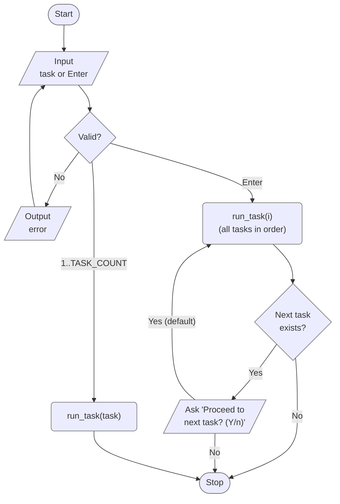
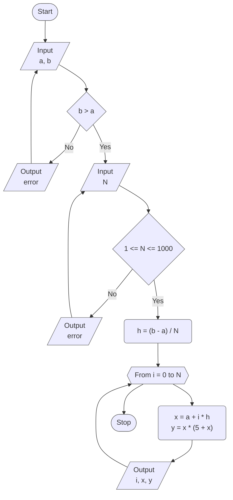
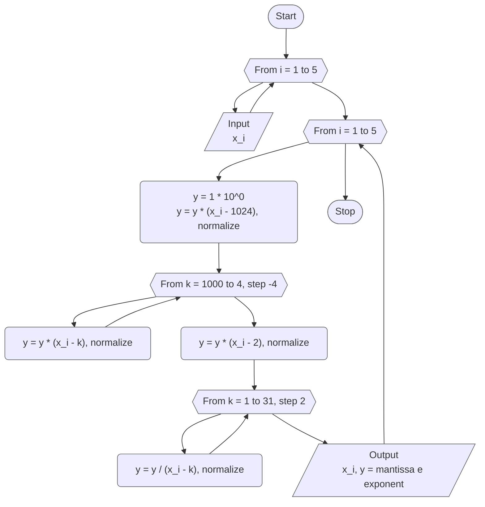
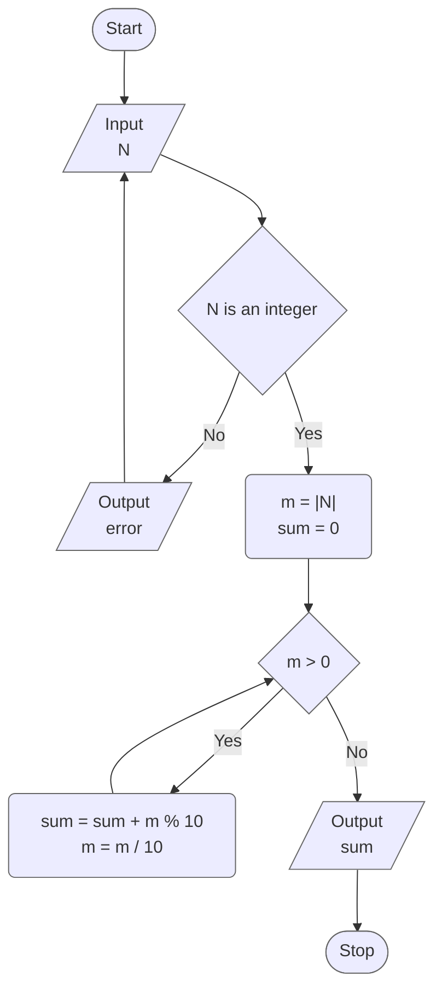
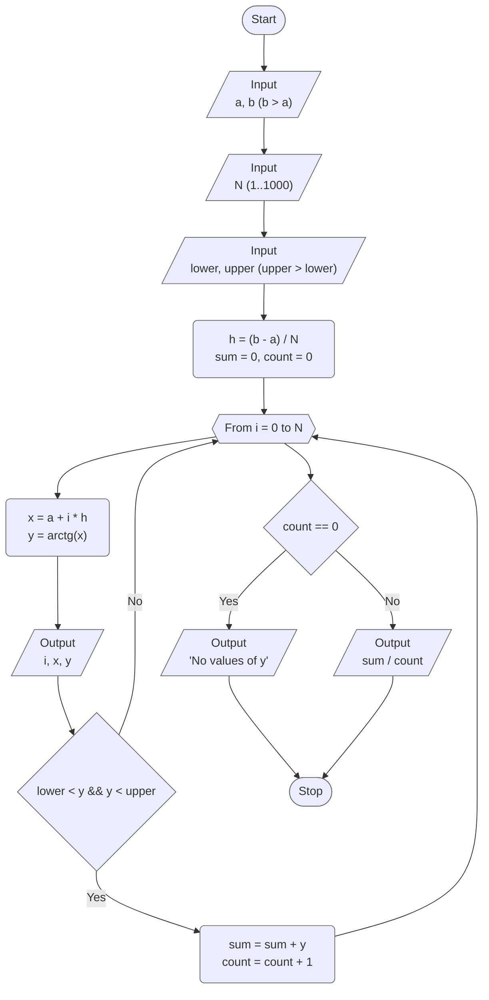
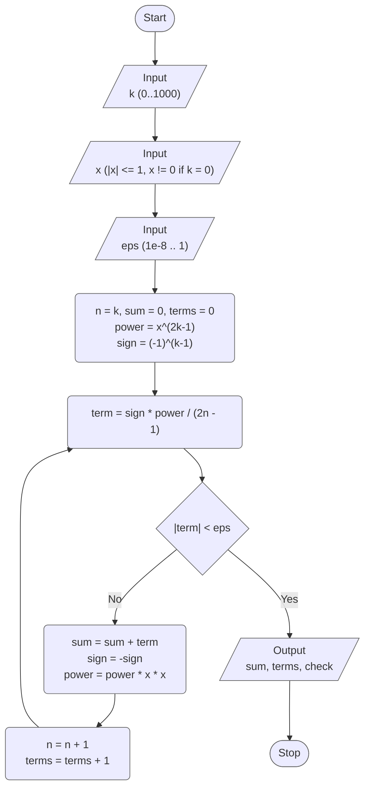

# Lab 03 - Cyclic algorithms

[Assignment](docs/lw-task-03.pdf) · [Report](docs/lw-report-03.pdf)

Variant 9. The goal of the lab is to get familiar with the loop operators
(`for`, `while`, `do while`), to program computational processes with a known
number of repetitions and iterative cyclic algorithms, and to describe each
algorithm with a block diagram before writing the code.

## Overview

| Task | What it does                                                                            |
|------|-----------------------------------------------------------------------------------------|
| 1    | Tabulates `y = x(5 + x)` on `[a; b]` with step `h = (b - a) / N`                        |
| 2    | Evaluates a product of factors `y` for five real values of `x`                          |
| 3    | Sum of the digits of an integer `N`                                                     |
| 4    | Tabulates `y = arctg x` on `[a; b]`, mean of `y` with `lower < y < upper`               |
| 5    | Sum of the series `a_n = (-1)^(n-1) x^(2n-1) / (2n-1)` from `n = k` with accuracy `eps` |

### Project layout

```
lab_03/
├── include/
│   ├── tasks.h   # task registry (X-macro), TASK_COUNT, run_task() / run_all_tasks()
│   └── utils.h   # constants and validated functions for input
└── src/
    ├── main.c    # menu, task number parsing
    ├── runner.c  # dispatches to run_task1() ... run_task5()
    ├── taskN.c   # each task 'N' in its own source file
    ├── ...
    └── utils.c   # implementation of utility functions
```

## Program flow



## Task 1 - Tabulation of a function

Tabulate `y = x(5 + x)` on the interval `[a; b]` with the step
`h = (b - a) / N`. The interval and the integer `N` are entered from the
keyboard (variant 9: `a = 1`, `b = 6`). The table consists of `N + 1` points
`x_i = a + i * h`, `i = 0 ... N`. Table 3.2 of the assignment lists no extra
values to calculate for this task.

`b` must be greater than `a`; `N` is accepted in the range `1...1000`.



## Task 2 - Product of factors

```
      (x - 1024)(x - 1000)(x - 996)...(x - 2)
y  =  ---------------------------------------
          (x - 1)(x - 3)(x - 5)...(x - 31)
```

Five real values `x1 ... x5` are entered from the keyboard (variant 9 was
checked with `0.5, 2.75, 15.5, 500.25, 1500.5`).

The numerator in the assignment is read as: the factor `x - 1024`, then the
factors `x - k` for `k = 1000, 996, ..., 4` (step 4), then `x - 2`. The
denominator is `x - k` for odd `k = 1, 3, ..., 31`.

Both products have hundreds of factors, so `y` exceeds the range of `double`
(about `1e308`) for most `x`. To avoid an overflow `y` is kept in scientific
notation: a mantissa in `[1; 10)` and a decimal exponent. After every
multiplication or division the mantissa is normalized back into `[1; 10)` and
the exponent is corrected, and `y` is printed as `mantissa e exponent`.

If `x` is an odd integer from `1` to `31`, it is a pole (a zero of the
denominator) and the program reports `undefined (division by zero)`; if `x` is
a root of the numerator, `y = 0`.



## Task 3 - Sum of the digits

Given an integer `N`, find the sum of its digits. The sign is ignored, so the
digits of `-12345` are summed as `12345`. Digits are taken one by one with
`N % 10` and `N / 10` until nothing is left. On invalid input the program prints
an error and asks for `N` again.



## Task 4 - Tabulation with a calculated value

Tabulate `y = arctg x` on `[a; b]` with the step `h = (b - a) / N` and
calculate the arithmetic mean of those `y` that satisfy `lower < y < upper`.
The interval, `N` and the limits of `y` are entered from the keyboard
(variant 9: `a = 0`, `b = 2`, `lower = 0`, `upper = 0.5`). `b` must be greater
than `a`, `upper` greater than `lower`, `N` is in the range `1...1000`.

With the variant's values the point `x = 0` gives `y = 0` and is therefore not
counted. If no `y` satisfies the condition, the program says so instead of
dividing by zero.



## Task 5 - Sum of a series

Calculate the sum of the series with a given accuracy `eps` at a given `x`,
starting from the index `k`. `k`, `x` and `eps` are entered from the keyboard
(variant 9: `k = 0`, `x = 0.65`, `eps = 0.0001`):

```
a_n = (-1)^(n-1) * x^(2n-1) / (2n-1),   n = k, k+1, k+2, ...
```

The `k` column of Table 3.4 is read as the first index of the summation
(`0` or `1`). Terms are added while `|a_n| >= eps`; the first term smaller than
`eps` is not added, and the program prints how many terms were summed.

For `n >= 1` this is the Taylor series of `arctg x`. For `k = 0` the first term
is `a_0 = 1 / x` (so `x = 0` is rejected), and the sum is `arctg x + 1 / x`;
for `k = 1` it is `arctg x`. The program prints this closed form as a check.

The series converges only for `|x| <= 1`, so `x` outside `[-1; 1]` is rejected
(otherwise the loop would never stop). `eps` is accepted in `[1e-8; 1]`; the
lower limit keeps the number of terms reasonable even at `|x| = 1`. `k` is
accepted in `0...1000`.



## Results

Inputs of variant 9 and the output of the program:

| Task | Input                                     | Output                                                                |
|------|-------------------------------------------|-----------------------------------------------------------------------|
| 1    | `a = 1`, `b = 6`, `N = 5`                 | `h = 1`, table of 6 points: `y(1) = 6`, `y(2) = 14`, ..., `y(6) = 66` |
| 2    | `x = 0.5`                                 | `y = +1.590622e+629`                                                  |
| 2    | `x = 2.75`                                | `y = +6.845860e+628`                                                  |
| 2    | `x = 15.5`                                | `y = +1.608161e+625`                                                  |
| 2    | `x = 500.25`                              | `y = +1.649069e+528`                                                  |
| 2    | `x = 1500.5`                              | `y = +1.044564e+700`                                                  |
| 2    | `x = 3` (odd integer)                     | `undefined (division by zero)`                                        |
| 3    | `N = -12345`                              | sum of the digits = `15`                                              |
| 4    | `a = 0`, `b = 2`, `N = 10`, `0 < y < 0.5` | `h = 0.2`, mean of `y` = `0.2890` (2 values)                          |
| 5    | `k = 0`, `x = 0.65`, `eps = 0.0001`       | sum = `2.114809`, 9 terms (`arctg 0.65 + 1/0.65 = 2.114837`)          |
| 5    | `k = 1`, `x = 0.65`, `eps = 0.0001`       | sum = `0.576347`, 8 terms (`arctg 0.65 = 0.576375`)                   |

## Build & run

Standalone (from this directory):

```bash
make build
make run
```

From the repository root:

```bash
make build LAB=03
make run LAB=03
```
