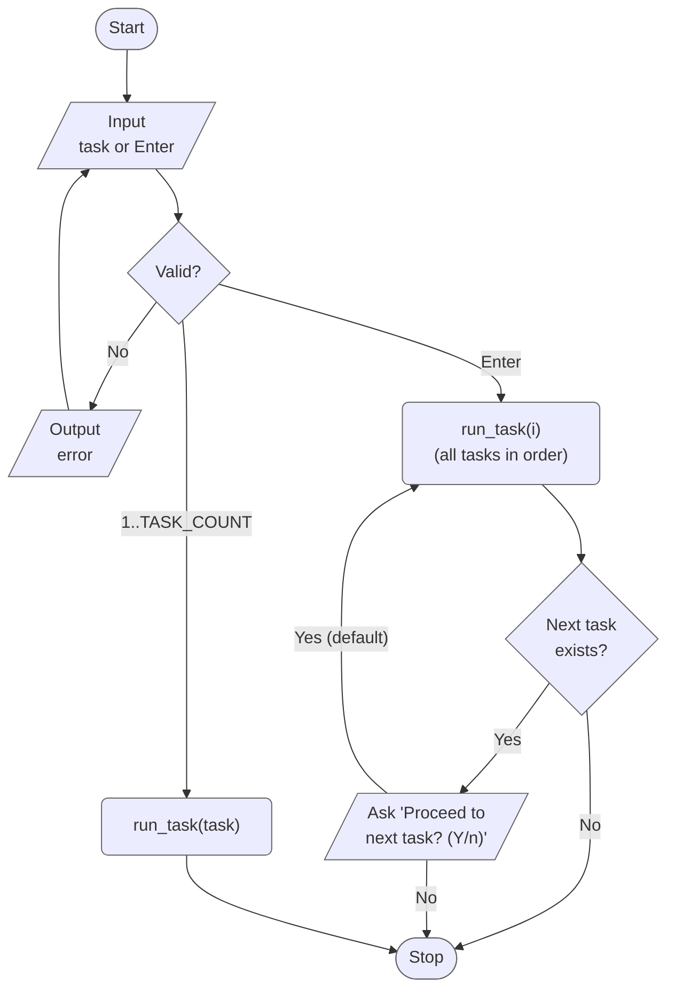
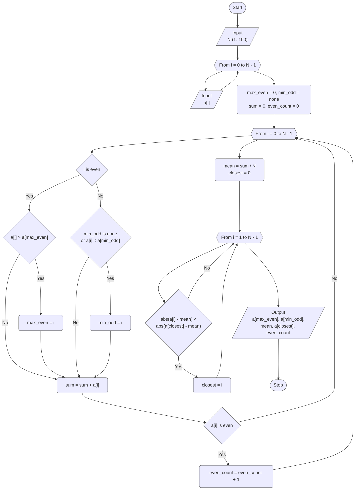
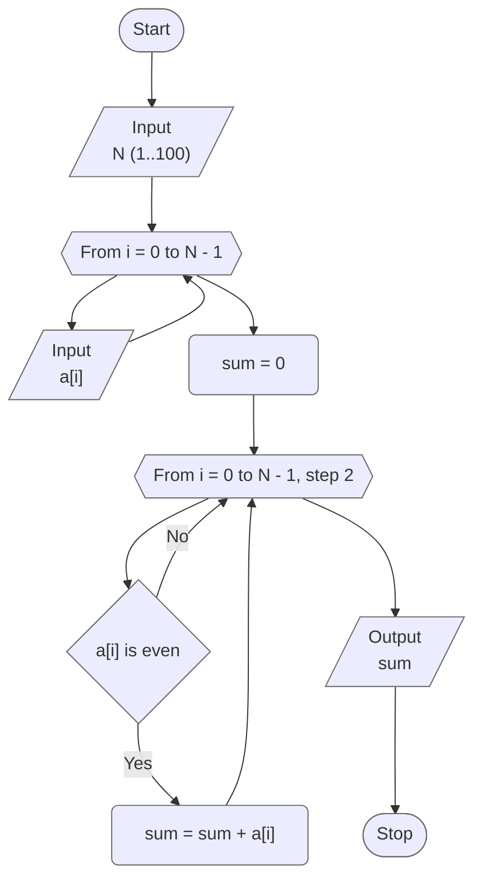
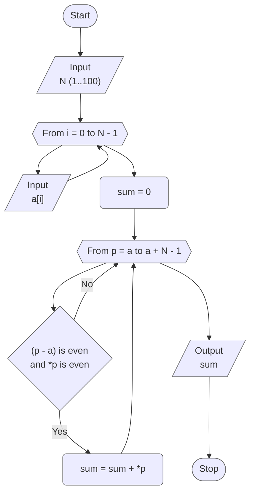

# Lab 04 - One-dimensional arrays

[Assignment](docs/lw-task-04.pdf) · [Report](docs/lw-report-04.pdf)

Variant 9. The goal of the lab is to study the basic algorithms for processing
one-dimensional arrays: input and output of an array with loops, searching for
extreme elements, accumulating sums, and accessing the elements both by indexing
and through a pointer.

## Overview

| Task | What it does                                                                                                        |
|------|---------------------------------------------------------------------------------------------------------------------|
| 1    | Largest element with an even index, smallest with an odd index, element closest to the mean, count of even elements |
| 2    | Sum of the even elements that have an even index (indexing)                                                         |
| 3    | The same, through pointer arithmetic                                                                                |

### Project layout

Flowcharts follow the notation of the assignment (Fig. 3.1 and 3.2): a hexagon
is the header of a loop with a parameter (`for`), the arrow returning to it
closes the loop body, and the other arrow leaves the loop when it is over.

```
lab_04/
├── include/
│   ├── tasks.h   # task registry (X-macro), TASK_COUNT, run_task() / run_all_tasks()
│   └── utils.h   # MAX_ARRAY_SIZE, MAX_ELEMENT_ABS, validated input, read_sequence()
└── src/
    ├── main.c    # menu, task number parsing
    ├── runner.c  # dispatches to run_task1() ... run_task3()
    ├── taskN.c   # each task 'N' in its own source file
    ├── ...
    └── utils.c   # implementation of utility functions
```

### Input helpers (`utils.h`)

| Function                         | Does                                                                    |
|----------------------------------|-------------------------------------------------------------------------|
| `read_long_in_range()`           | integer in `[min; max]`, asks again on invalid input                    |
| `read_optional_long_in_range()`  | the same, but an empty line is accepted too (used for the task menu)    |
| `read_sequence()`                | asks for `N` (`1...MAX_ARRAY_SIZE`), then for `N` elements              |
| `print_sequence()`               | prints the sequence as `a = [1, 2, 3]`                                  |

They return `false` only when the input stream is over (EOF), so a task never
loops forever.

## Program flow



## Task 1 - Extreme elements, mean and even numbers

Given a sequence `a`, find:

- the largest element with an even ordinal number (`a[0], a[2], ...`);
- the smallest element with an odd ordinal number (`a[1], a[3], ...`); for
  `N = 1` there is none and the program says so;
- the element closest to the arithmetic mean of the sequence (the first one if
  several are equally close);
- the number of even elements.

The first pass collects the extremes, the sum and the number of even elements,
the second pass looks for the element closest to the mean `sum / N`.



## Task 2 - Sum of even elements with even ordinal numbers (indexing)

Given a sequence `a`, find the sum of the numbers that have even ordinal numbers
and are even themselves. Only `a[0], a[2], a[4], ...` are visited (the loop step
is 2), and an element is added when `a[i] % 2 == 0`.



## Task 3 - Sum of even elements with even ordinal numbers (pointer)

The same, but the elements are visited through a pointer `p` that runs from `a`
to `a + N`. The ordinal number of `*p` is `p - a`. The loop does not use
`p += 2`: for an odd `N` that would move the pointer two elements past the end
of the array, which is undefined behaviour in C.



## Results

| Task | Input                           | Output                                                                                                                                  |
|------|---------------------------------|-----------------------------------------------------------------------------------------------------------------------------------------|
| 1    | `N = 7`, `a = 4 -3 10 8 -3 6 5` | largest with an even index: `a[2] = 10`; smallest with an odd index: `a[1] = -3`; mean `3.8571`, closest `a[0] = 4`; even elements: `4` |
| 1    | `N = 1`, `a = 7`                | `a[0] = 7`; no odd index; mean `7.0000`, closest `a[0] = 7`; even elements: `0`                                                         |
| 2    | `N = 6`, `a = 2 4 6 8 3 10`     | `Sum: 8` (elements `a[0] = 2`, `a[2] = 6`; `a[4] = 3` is odd)                                                                           |
| 3    | `N = 5`, `a = 2 4 6 8 3`        | `Sum: 8`                                                                                                                                |

## Build & run

Standalone (from this directory):

```bash
make build
make run
```

From the repository root:

```bash
make build LAB=04
make run LAB=04
```
